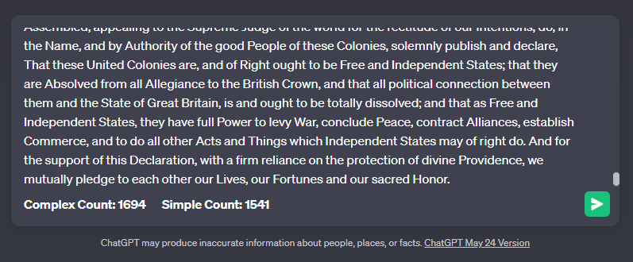

# Token-Counter-for-ChatGPT
A simple **Tampermonkey** Script that counts tokens in **ChatGPT's** interface.

## Token Counter

This is a simple coding exercise that I wanted to try because I was getting tired of guessing how many tokens I had in my prompt textbox when I pasted large amounts of text or code in **[ChatGPT](https://chat.openai.com/)**. 

## Quick Start

Make sure you have **[Tampermonkey](https://www.tampermonkey.net)** installed in your browser, open `Token Counter.user.js` in [RAW](https://github.com/SpriteSixis/Token-Counter-for-ChatGPT/blob/main/Token%20Counter.user.js) view and **Tampermonkey** should recognize it and give you the option of installing it, then just click on the extension so that you make sure that the script is enabled, and finally refresh your browser. 

## Basic Explanation

This script adds a **Token Counter** element that appears in the bottom part of the text input field and updates the count in real-time as the user types. It uses a simplified token counting approach, treating spaces, punctuation, and common contractions as separate tokens *(I know, more on that below.)* The **Token Counter's** color changes as you approach the token limit, which as you know is 4097 tokens, so I made the counter turn **Yellow** when you're close, **Red** when you're on the edge *(more on that below)* and **DarkGray** when you are probably over the limit.

## Installation

**Quickest**

1) Install **Tampermonkey** on your browser. *(I haven't tried other browser or extensions, I will do more testing on this and update it.)*
2) Open `Token Counter.user.js` in [RAW](https://github.com/SpriteSixis/Token-Counter-for-ChatGPT/blob/main/Token%20Counter.user.js) view and **Tampermonkey** should recognize it, click **"Install"**.
3) Make sure the script is activated on the **Tampermonkey** extension.

**Alternatives**

1) In the **"Utilites"** tab of the **Tampermonkey** dashboard, just paste this link in the **"Install from URL"** textbox.
2) Download the  `Token Counter.user.js` [script](https://github.com/SpriteSixis/Token-Counter-for-ChatGPT/blob/main/Token%20Counter.user.js) from above and select the **"Import from file"** option in the **Tampermonkey "Utilites"** tab.
3) Alternatively you can just click on the `+` sign in the **Tampermonkey Dashboard** to create a **New File**, then open `Token Counter.user.js` script on this repo and copy all of its contents and paste them into the **New File** you created and **Save** it. 

## Detailed Explanation

***(Note. Read this is only if you are curious to know a bit more about the token counting function, and if you want to try some variations that I have uploaded as well.)***

Ok, so as you know, Token Counting is complex and there is not a single method of counting that is reliable, and even **ChatGPT** uses different methods for their **GPT 3.5** and **GPT 4** models. But let us take into account this words from [OpenAi](https://help.openai.com/en/articles/4936856-what-are-tokens-and-how-to-count-them) themselves.

<pre>
Tokens can be thought of as pieces of words. Before the API processes the prompts, 
the input is broken down into tokens. These tokens are not cut up exactly where the words
start or end - tokens can include trailing spaces and even sub-words. Here are some helpful
rules of thumb for understanding tokens in terms of lengths:

- 1 token ~= 4 chars in English
- 1 token ~= ¾ words
- 100 tokens ~= 75 words

Or 

- 1-2 sentence ~= 30 tokens
- 1 paragraph ~= 100 tokens
- 1,500 words ~= 2048 tokens

To get additional context on how tokens stack up, consider this:

- Wayne Gretzky’s quote "You miss 100% of the shots you don't take" contains 11 tokens.
- The phrase in spanish "Cómo estás" contains 5 tokens.
- The transcript of the US Declaration of Independence contains 1,695 tokens.
</pre>

So with this in mind, my goal was to create a really simple **Token Counter** script that would let you have an approximation with an acceptable margin of error, mainly to stop wasting time trying to guess if my large pasted prompts would fit or not. It seemed like it worked great until I tried the `"Cómo estás"` example. 

As you can see, it only counts **"2" Tokens**. So to make a long story short, I researched a bit about Token encoding and found [tiktoken](https://github.com/openai/tiktoken/tree/main) and a [GPT-3-Encoder](https://github.com/latitudegames/GPT-3-Encoder) code that I could try to adapt for fun into a new Tampermonkey Script. And this was the result:

So as you can see, it worked, it has a peculiar way of counting, totally different from the Simpler method, however most of the time they arrive at the same result. 

Here is an example of both of them in action.

*(From now on, all the images you see will be using another variaton of the Script I made which displays both counters at the same time for clarity.)*

So you would think that was it, I should just use the **TikToken** method and discard the old one, right? Well... no, unfortunately this uses GPT 2 encoding for counting tokens so it does not work well at all when you paste code. 

As you can see the complex counting method goes crazy high, an amount that GPT would never handle but the simpler counting method says that the number is much lower, so which should we trust? Well, we can use [this](https://huggingface.co/spaces/JacobLinCool/tiktoken-calculator) **HuggingFace** tool to help us find out. 

As you can see the **"Simple Counter"** is much closer to the `cl100k_base` encoder that GPT 4 uses, while the **"Complex Counter"** is pretty much right on the money with `gpt2` as it's supposed to be.

Finally, here is the result of the comparison with the US Declaration of Independece.

The **"Complex Counter"** is this time again, pretty much right on the money, while the **"Simple Counter"** lagged a bit behind, but still it was not that bad. 

**Where does it fail?**

I need to mention that this was mainly made for English characters, as you can see, even in Spanish there is quite a bit of difference. I tried an example with Chinese characters and this is the result.

The difference between the two is wild. If we check it on **HuggingFace**:

We see that here our complex counter was closer to the correct answer, it has the same result as the GPT 3 encoder. 

So after a lot of thought I ultimately decided to upload my first version of the script, the **"Simple Counter"** as the main version instead of the **"Tiktoken"** one, not only is it way lighter but I feel it's more useful all-around.

**TL;DR**

Use the main version if you want something light and simple, use the Tiktoken version inside the variations folder if you want something heavier and super precise and you mainly use text, not code.

## Variations

Follow the same steps as the instructions above if you want to try these out. 

-----
**WARNING: THESE ARE 100K LINES OF CODE EACH, IT MIGHT CRASH YOUR BROWSER JUST TO LOAD THE PAGES, I RECOMMEND DOWNLADING A ZIP OF THE REPO INSTEAD AND THEN IMPORTING THOSE FILES MANUALLY TO YOUR TAMPERMONKEY.**
-

1) **Tiktoken Counter V1.** Open the [RAW](https://github.com/SpriteSixis/Token-Counter-for-ChatGPT/blob/main/variations/TikToken%20Counter%20V1.user.js) code.
2) **Merged Counters V1.** If you want to use both. Open the [RAW](https://github.com/SpriteSixis/Token-Counter-for-ChatGPT/blob/main/variations/Merged%20Token%20Counters%20V1.user.js) code.

**WARNING: THESE ARE 100K LINES OF CODE EACH, IT MIGHT CRASH YOUR BROWSER JUST TO LOAD THE PAGES, I RECOMMEND DOWNLADING A ZIP OF THE REPO INSTEAD AND THEN IMPORTING THOSE FILES MANUALLY TO YOUR TAMPERMONKEY.**
-

-----

## Browser Compatibility

Tested only on Windows with the latest version of **Chrome** and **Tampermonkey**. *(Will update this as I keep testing other platforms and devices.)*

## Credits

This project makes use of:

- [Tampermonkey](https://www.tampermonkey.net) by Jan Biniok
- [tiktoken](https://github.com/openai/tiktoken/tree/main) by OpenAI
- [GPT-3-Encoder](https://github.com/latitudegames/GPT-3-Encoder) by Latitude Games

## Contributing

Open for whatever.

## License

This project is licensed under the MIT License - see the [LICENSE](LICENSE) file for details.

## Contact

If you want to support more projects like this here's a link: [Sprite6](https://ko-fi.com/sprite6). 
